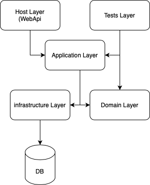

# cashless
Cashless Microservice version 1

All code MUST be in english language!

<h1>Dependencies    <h1>

<table>
    <tr>
        <td>Nome</td>
        <td>Version</td>
    </tr>
    <tr>
        <td>Microsoft .net core</td>
        <td>3.1</td>
    </tr>
    <tr>
        <td>XUnit</td>
        <td>2.4.0</td>
    </tr>
    <tr>
        <td>Microsoft Entity Framework</td>
        <td>5.0.8</td>
    </tr>
</table>

<h2>Layers<h2>

